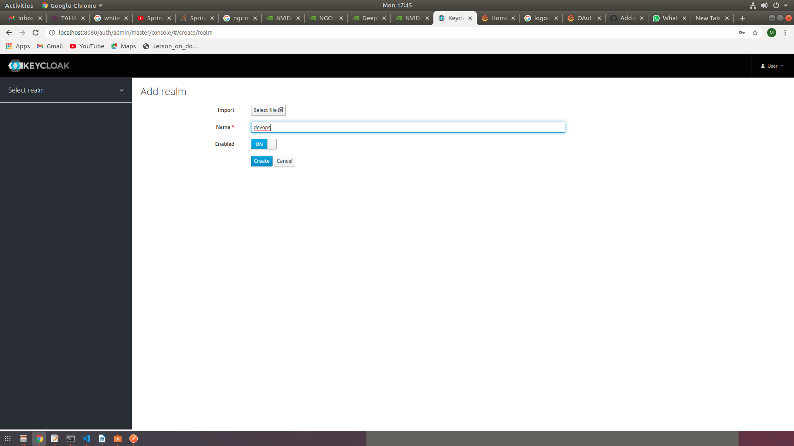

# Integrating Grafana with Keycloak with Docker

Keycloak is a centralized authentication and authorization server equipped with standard SSO(Single-Sign On) protocols like OAuth, SAML, etc.,

Grafana is a visualization and monitoring tool with customized graphsm panels, dashboards.

## Settingup Keycloak, Grafana servers using Docker Compose
docker-compose.yml
```yml
version: "2"
services:
  postgresql:
    image: "docker.io/bitnami/postgresql:11-debian-10"
    container_name: postgresql
    environment:
      - ALLOW_EMPTY_PASSWORD=yes
      - POSTGRESQL_USERNAME=bn_keycloak
      - POSTGRESQL_DATABASE=bitnami_keycloak
    volumes:
      - "postgresql_data:/bitnami/postgresql"
  
  keycloak:
    image: docker.io/bitnami/keycloak:11-debian-10
    container_name: keycloak
    ports:
      - "8080:8080"
    environment:
      - KEYCLOAK_CREATE_ADMIN_USER=true
    depends_on:
      - postgresql
  
  grafana:
    build: grafana
    container_name: grafana
    ports:
      - "3000:3000"
  
volumes:
  postgresql_data:
    driver: local
```


In the above, docker-compose file, running 3 containers i.e,

    * Keycloak: Using bitnami's Keycloak image
    * Grafana: Grafana's official imahe from docker hub
    * Postgresql: Using bitnami's Postgresql image(Postgresql database is used by keycloak server to store the realm,clients, roles, users,etc., data)

Run the compose file with the following command, after pulling the code from github:
> sudo docker-compose up --build

## Preparing Keycloak server to authenticate Grafana
Follow the steps for enabling oauth access to Grafana:
1. After running docker-compose file, access the keycloak server at localhost:8080, it will navigate to Keycloak's home page.
2. Click on Administration console link, and enter the following credentials and ensure the login is successful:

    *username: user*

    *password: bitnami*

3. Now before proceeding we have to understand the following terms:

    * Realm: It can be created for organization/tenant
    * Client: It refers to the application for which we are authenticating
4. Our first step is to create a Realm.
5. Hover on the left handside of the webapp, and click on 'Add Realm'


6. Enter a realm name and then click on Create.


7. Now, Create a client in the created Realm, by clicking on 'Clients' in the left side pane.


8. Click on 'Create' and create a new client for your application with the following details and then click on 'Save' button:
    * Client-ID: [Name of your application]
    * Client Protocol: openid-connect
    * Root URL: [URL of your application]

 

9. In the clients page set 'Access Type' to 'Confidential' and then click on  'Save'.


10. After saving the changes 'Credentials' tab appears. Copy the client-secret for the further use.

11. Now, Create Roles and Users for accessing the client/application.
    * Create 2 Roles, one for admin and another for user.
    * Create 2 Users, one as admin-user and another for general-user.

12. Creating a role for admin:
    * Click on 'Roles' and then click on 'Add Role' button.
    
    
    

    Similarly, create a role for user.

13. Create a user for admin role:
    * Click on 'Users' and then click on 'Add User' button.
    
    * Provide a user name, mail id, etc., and then click on 'Save' button.
    
    * Set a password for the user by clicking on 'Credentials' tab and set 'Temporary' to 'OFF'(This means that after first login, no need to change the password)
    
    
    Similarly, create another user for general user.

14. Map the Roles and users to the client/application:
    * After creation of Users, click on 'Users' on the left side pane.
    * Click on Role Mappings tab and map the 'admin-user' to 'admin' role for client-roles and select the client.
    * Similarly, map the other user to 'user' role for the client.
    

## Setting-up Grafana
Copy the following content into '/etc/grafana/grafana.ini'
```ini
[auth.generic_oauth]
enabled = true
name = Oauth
allow_sign_up = true
client_id = grafana
client_secret = 85fd1aa0-9ffc-4248-9247-7dcdd7dba11d
scopes = email profile roles web-origins openid
auth_url = http://192.168.0.160:8080/auth/realms/demo/protocol/openid-connect/auth
token_url = http://192.168.0.160:8080/auth/realms/demo/protocol/openid-connect/token
api_url =http://192.168.0.160:8080/auth/realms/demo/protocol/openid-connect/userinfo
```

Here,
enabled : refers for enabling Oauth protocol connection

name: Name of the protocol

allow_sign_up: Allowing sign up from the client/application using oauth.

client_id: client_id name set in the keycloak server

client_secret: the client secret copied in step-10 paste it here.

auth_url: Authentication url for the client. The auth url varies for various clients, can be formed as follows,
http://<domain-name>/auth/realms/<realm_name>/protocol/openid-connect/auth

token_url = Url for generating tokens. The token url varies for various clients, can be formed as follows,
http://<domain-name>/auth/realms/<realm_name>/protocol/openid-connect/token

api_url = URL for client/application APIs. The api url varies for various clients, can be formed as follows,
http://<domain-name>/auth/realms/<realm_name>/protocol/openid-connect/userinfo

## Accessing Grafana with OAuth enabled from Keycloak server
Run the docker-compose file with the following command, after modifying the 'grafana.ini' file in 'grafana' folder with necessary changes.
> sudo docker-compose up --build


From browser navigate to http://localhost:3000 to access grafana server, grafana login page appears with option to sign in for oauth:


Click on Sign-in with Oauth, and then the page navigates to keycloak login page, there we can login with the created users in keycloak


Login should be successful for grafana application with the created keycloak user credentials:

